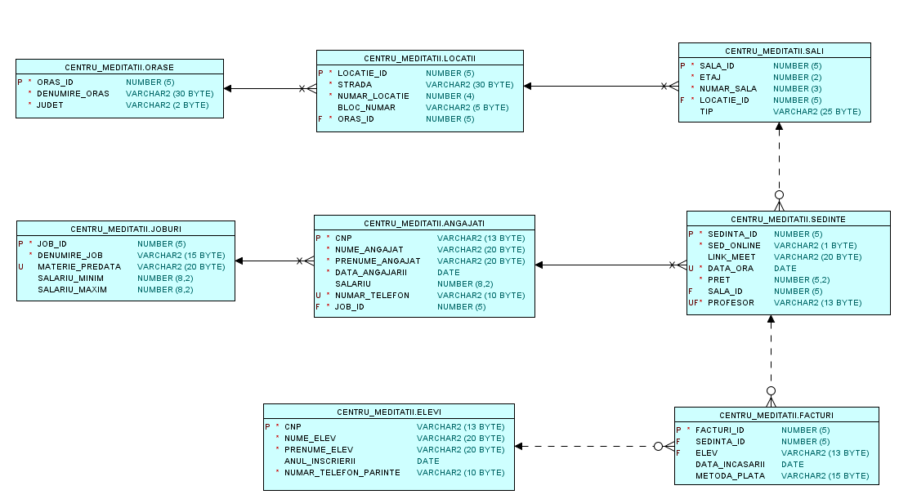

# Afterschool-Database

## Table of content

1. [Description](#description)
2. [Database design](#database-design)
3. [SQL code](#sql-code)
4. [Integration using python](#integration)
5. [License](#license)
   
## Description
This project aims to create a database system for an afterschool program focused on exam preparation. It utilizes Oracle SQL for backend database management and Python with Flask for the frontend interface.
This readme file will contain general information about this project. For more information about the database check [Documentation file](Documentatie.docx), and if you want to know more about the integration check [Integration file](Documentatie_integrare.docx).

## Database design
This database will have 7 entities and an associative table as shown in diagram below:

## SQL code
Using the diagram I create the database, adding constrains and unique index - that permite to have a pair a columns unique just if one of the columns is not null.
In [script](script.sql) are 3 steps:
  - drop step - deleting all the tables
  -  create step - create all the tables with constrains and unique indexies
  -  insert step - add rows in all tables

## Integration using python
The integration step can be seen in [integration folder](integrare) where using Flask and Oracle database module, I extract information from the local database created using SQLplus for Windows. In the conection will need to be replace the username and the password for a local. 

## License
This project is licensed under the [MIT License](LICENSE).
  
